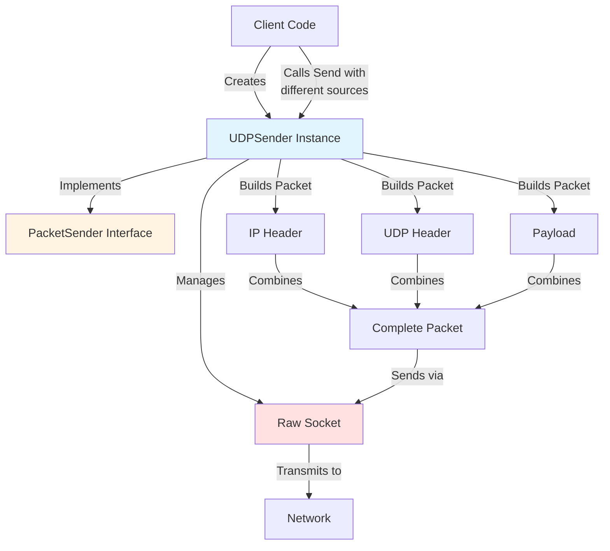
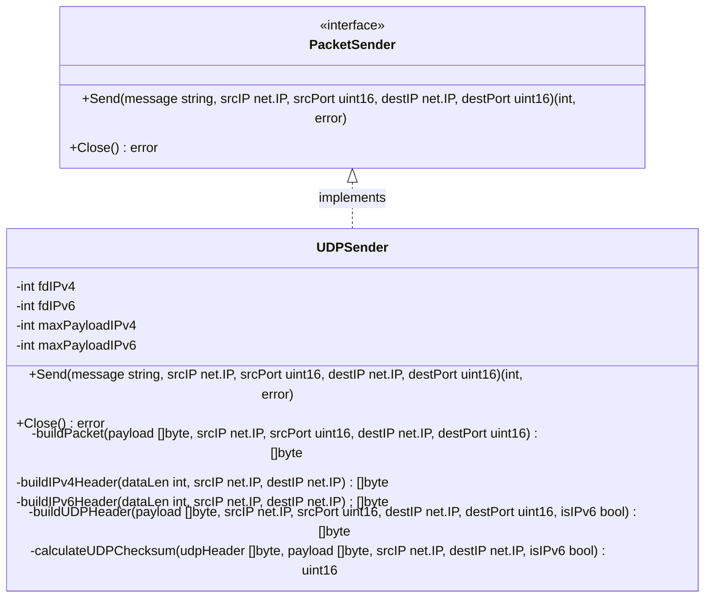
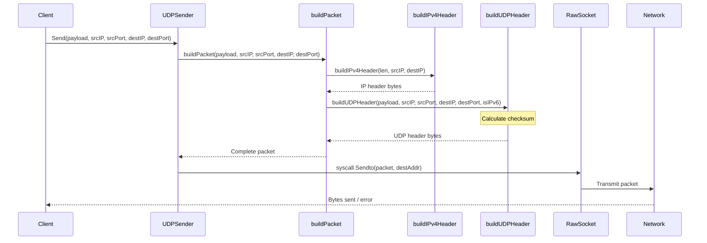
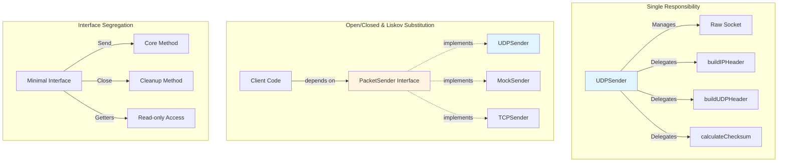
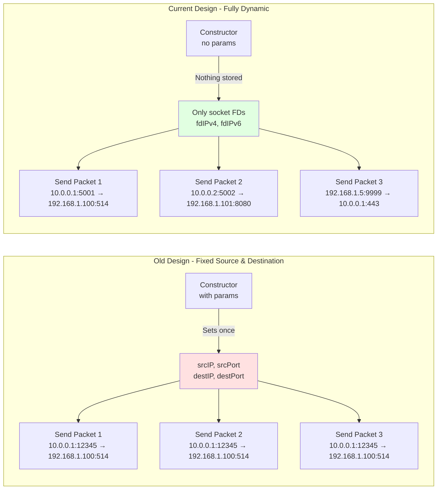
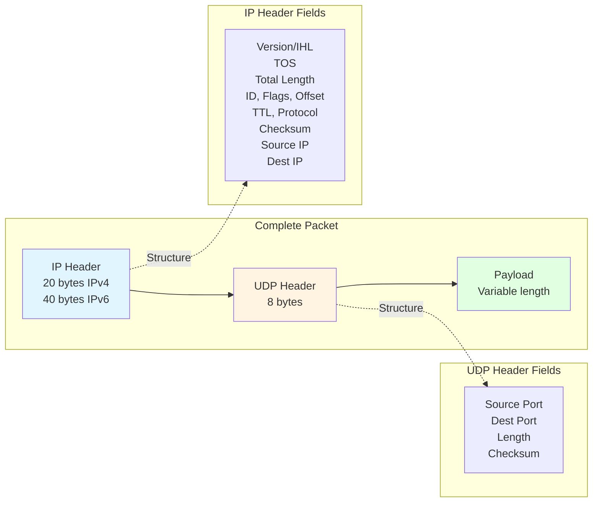
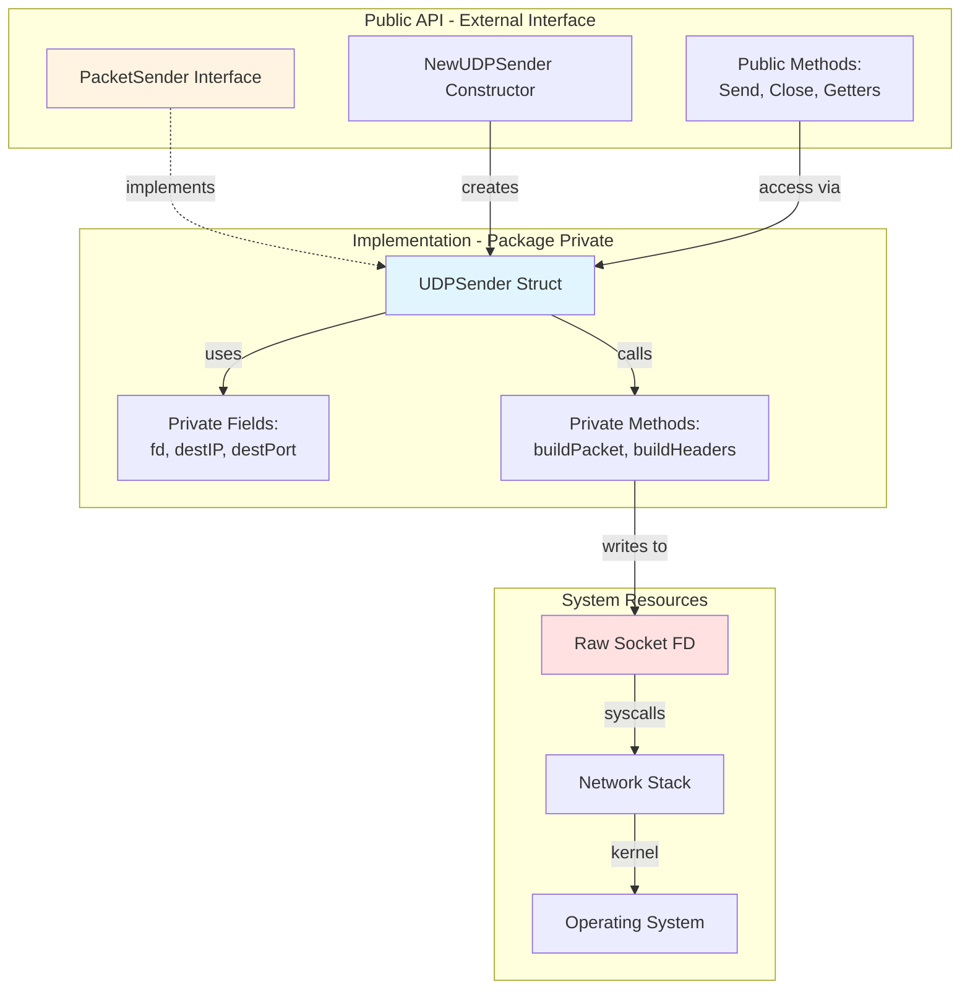
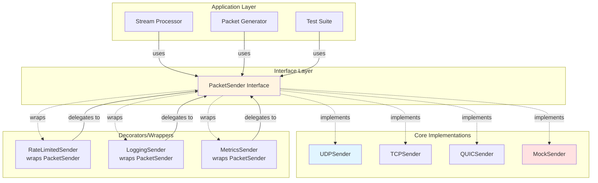

# UDPSender Class Design

## Overview

The `UDPSender` is implemented as a Go class using idiomatic Go patterns: structs with methods, interfaces, and proper encapsulation. The key design feature is **per-packet source and destination address specification**, allowing complete dynamic control of both source and destination IP and port for each transmitted packet. The implementation supports both IPv4 and IPv6 through separate raw sockets.



## Class Structure

### Interface Definition

```go
type PacketSender interface {
    Send(message string, srcIP net.IP, srcPort uint16, destIP net.IP, destPort uint16) (int, error)
    Close() error
}
```

**Design Decision**: Both source and destination IP and port are specified per packet in the `Send()` method for maximum flexibility. Uses proper types (`net.IP` and `uint16`) instead of strings for type safety and efficiency.



### Class Implementation

```go
type UDPSender struct {
    fdIPv4         int  // Private: raw socket file descriptor for IPv4
    fdIPv6         int  // Private: raw socket file descriptor for IPv6
    maxPayloadIPv4 int  // Private: maximum payload size for IPv4 based on MTU
    maxPayloadIPv6 int  // Private: maximum payload size for IPv6 based on MTU
}
```

**Key Design Philosophy**: The struct stores only what's absolutely necessary (socket file descriptors and MTU-based payload limits). Neither source nor destination IP and port are stored. All addressing information is passed as parameters to the `Send()` method, enabling complete dynamic control of both source and destination per packet.

## Object-Oriented Principles

### 1. Encapsulation

**Private Fields**: All struct fields use lowercase names, making them package-private:

```go
fdIPv4         int  // Not accessible outside the package - IPv4 raw socket
fdIPv6         int  // Not accessible outside the package - IPv6 raw socket
maxPayloadIPv4 int  // Not accessible outside the package - MTU-based IPv4 payload limit
maxPayloadIPv6 int  // Not accessible outside the package - MTU-based IPv6 payload limit
```

**No Getters**: Neither source nor destination IP/port are stored in the struct, so there are no getter methods. Both source and destination are specified per call to `Send()` for complete per-packet control.

### 2. Constructor Pattern

Factory function to create and initialize instances:

```go
func NewUDPSender(maxPayloadIPv4, maxPayloadIPv6 int) (*UDPSender, error)
```

**Parameters**:
- `maxPayloadIPv4`: Maximum payload size for IPv4 packets (based on MTU - 20 - 8)
- `maxPayloadIPv6`: Maximum payload size for IPv6 packets (based on MTU - 40 - 8)

Benefits:

- Validation before object creation
- Complex initialization logic
- Returns errors instead of invalid objects
- Resource acquisition (creates both IPv4 and IPv6 raw sockets)
- MTU configuration for payload validation
- No destination needed (both source and destination specified per packet)

### 3. Interface Implementation

The class implements the `PacketSender` interface, enabling:

- **Polymorphism**: Multiple implementations can satisfy the interface
- **Dependency Injection**: Functions can accept `PacketSender` instead of concrete type
- **Testing**: Easy to create mock implementations
- **Future Extensions**: New sender types (TCP, mock, etc.)

Compile-time verification:

```go
var _ PacketSender = (*UDPSender)(nil)
```

### 4. Method Types

**Public Methods** (exported):

- `Send(message string, srcIP net.IP, srcPort uint16, destIP net.IP, destPort uint16) (int, error)` - Send UDP packet with specified source and destination
- `Close() error` - Release resources (closes both IPv4 and IPv6 sockets)

**Private Methods** (package-private):

- `buildPacket(payload []byte, srcIP net.IP, srcPort uint16, destIP net.IP, destPort uint16) []byte`
- `buildIPv4Header(dataLen int, srcIP net.IP, destIP net.IP) []byte`
- `buildIPv6Header(dataLen int, srcIP net.IP, destIP net.IP) []byte`
- `buildUDPHeader(payload []byte, srcIP net.IP, srcPort uint16, destIP net.IP, destPort uint16, isIPv6 bool) []byte`
- `calculateUDPChecksum(udpHeader []byte, payload []byte, srcIP net.IP, destIP net.IP, isIPv6 bool) uint16`

**Key Design**: All packet-building methods accept both source and destination as parameters. Nothing is stored in the struct except the socket file descriptors.



### 5. SOLID Principles

#### Single Responsibility

- UDPSender: Manages UDP packet sending with raw sockets
- Separate methods for each concern (IP header, UDP header, checksums)

#### Open/Closed

- Open for extension: Interface allows new implementations
- Closed for modification: Core functionality is stable

#### Liskov Substitution

- Any `PacketSender` implementation can be used interchangeably
- UDPSender maintains the interface contract

#### Interface Segregation

- Minimal interface with only essential methods
- Clients depend only on what they need

#### Dependency Inversion

- Code depends on `PacketSender` interface, not concrete class
- High-level code doesn't depend on low-level implementation



## Usage Patterns

### Direct Instantiation

```go
// Calculate max payload sizes based on MTU (e.g., 1500 bytes)
maxPayloadIPv4 := 1500 - 20 - 8  // 1472 bytes
maxPayloadIPv6 := 1500 - 40 - 8  // 1452 bytes

// Create sender with MTU-based payload limits (creates both IPv4 and IPv6 sockets)
sender, err := NewUDPSender(maxPayloadIPv4, maxPayloadIPv6)
if err != nil {
    log.Fatal(err)
}
defer sender.Close()

// Specify source and destination per packet
srcIP := net.ParseIP("10.0.0.1")
destIP := net.ParseIP("192.168.1.100")
n, err := sender.Send("Hello, World!", srcIP, 12345, destIP, 514)
```

### Dynamic Spoofing

```go
sender, _ := NewUDPSender(1472, 1452)  // Standard MTU limits
defer sender.Close()

// Send from different sources to different destinations
sender.Send("Packet 1", net.ParseIP("10.0.0.1"), 5001, net.ParseIP("192.168.1.100"), 514)
sender.Send("Packet 2", net.ParseIP("10.0.0.2"), 5002, net.ParseIP("192.168.1.101"), 514)
sender.Send("Packet 3", net.ParseIP("192.168.1.5"), 6000, net.ParseIP("10.0.0.1"), 8080)

// IPv6 works too
sender.Send("IPv6 Packet", net.ParseIP("2001:db8::1"), 5000, net.ParseIP("2001:db8::100"), 8080)
```

### Interface-Based

```go
func sendPacket(ps PacketSender, message string, srcIP net.IP, srcPort uint16, destIP net.IP, destPort uint16) error {
    _, err := ps.Send(message, srcIP, srcPort, destIP, destPort)
    return err
}

sender, _ := NewUDPSender(1472, 1452)  // Standard MTU limits
srcIP := net.ParseIP("10.0.0.1")
destIP := net.ParseIP("192.168.1.100")
sendPacket(sender, "Using interface", srcIP, 12345, destIP, 514)
```

### Polymorphic Collections

```go
var senders []PacketSender
senders = append(senders, udpSender1)
senders = append(senders, udpSender2)

// Each packet can have different source and destination
destIP := net.ParseIP("192.168.1.100")
for i, sender := range senders {
    srcIP := net.ParseIP(fmt.Sprintf("10.0.0.%d", i+1))
    srcPort := uint16(5000 + i)
    sender.Send("Broadcast message", srcIP, srcPort, destIP, 514)
}
```

## Comparison: Old vs New Design



### Old Design (Fixed Source & Destination)

```go
type UDPSender struct {
    fd       int
    destIP   net.IP
    destPort uint16
    srcIP    net.IP    // Fixed at construction
    srcPort  uint16    // Fixed at construction
}

// Source and destination were fixed - couldn't change per packet
sender, _ := NewUDPSender("dest", "8080", "src", "12345")
sender.Send("Message 1")  // Always from src:12345 to dest:8080
sender.Send("Message 2")  // Always from src:12345 to dest:8080
```

### Current Design (Dynamic Source AND Destination)

```go
type UDPSender struct {
    fdIPv4         int  // IPv4 raw socket
    fdIPv6         int  // IPv6 raw socket
    maxPayloadIPv4 int  // MTU-based payload limit for IPv4
    maxPayloadIPv6 int  // MTU-based payload limit for IPv6
    // No source or destination fields - both specified per packet!
}

// Both source and destination can change for each packet
sender, _ := NewUDPSender(1472, 1452)  // MTU-based payload limits
sender.Send("Message 1", net.ParseIP("10.0.0.1"), 5001, net.ParseIP("192.168.1.100"), 514)
sender.Send("Message 2", net.ParseIP("10.0.0.2"), 5002, net.ParseIP("192.168.1.101"), 8080)
sender.Send("Message 3", net.ParseIP("192.168.1.5"), 9999, net.ParseIP("10.0.0.1"), 443)
```

**Benefits of Current Design**:

- ✅ Maximum flexibility - change both source AND destination per packet
- ✅ Simplest struct - only socket file descriptors
- ✅ Perfect for simulating distributed sources and targets
- ✅ Minimal state management
- ✅ Explicit parameters - source and destination clear in each call
- ✅ IPv4 and IPv6 support with automatic protocol detection

### Packet Structure



## Testing Benefits

### Mockable Interface

```go
type MockSender struct {
    sentMessages []string
    sentFromIPs  []net.IP
    sentToIPs    []net.IP
}

func (m *MockSender) Send(msg string, srcIP net.IP, srcPort uint16, destIP net.IP, destPort uint16) (int, error) {
    m.sentMessages = append(m.sentMessages, msg)
    m.sentFromIPs = append(m.sentFromIPs, srcIP)
    m.sentToIPs = append(m.sentToIPs, destIP)
    return len(msg), nil
}

func (m *MockSender) Close() error { return nil }
```

### Test Through Interface

```go
func TestSendLogic(t *testing.T) {
    mock := &MockSender{}
    var sender PacketSender = mock
    
    // Test without needing root privileges
    srcIP := net.ParseIP("10.0.0.1")
    destIP := net.ParseIP("192.168.1.100")
    n, err := sender.Send("test", srcIP, 5000, destIP, 514)
    
    // Verify
    if err != nil || n != 4 {
        t.Errorf("unexpected result")
    }
    if len(mock.sentMessages) != 1 || mock.sentMessages[0] != "test" {
        t.Errorf("message not sent correctly")
    }
}
```

## Design Decisions

### Why Private Fields?

1. **Data Integrity**: Prevent external modification of internal state
2. **Future-Proof**: Can change internal representation without breaking API
3. **Validation**: Control how data is set and accessed
4. **Immutability**: Read-only access through getters

### Why Interface?

1. **Flexibility**: Easy to add new implementations
2. **Testing**: Mock implementations for unit tests
3. **Decoupling**: Code depends on abstraction, not concrete type
4. **Documentation**: Interface serves as contract

### Why Constructor Function?

1. **Validation**: Check inputs before creating object
2. **Resource Management**: Acquire system resources (raw socket)
3. **Error Handling**: Return errors for invalid configurations
4. **Initialization**: Complex setup logic in one place

## Encapsulation Architecture



## Future Extensions

The class design allows for easy extensions:

### Alternative Implementations

```go
type TCPSender struct { ... }      // TCP-based sender
type QUICSender struct { ... }     // QUIC-based sender
type MockSender struct { ... }     // Testing mock
```

All can implement `PacketSender` interface.

### Additional Methods

```go
func (s *UDPSender) SetTTL(ttl uint8) error
func (s *UDPSender) SetTOS(tos uint8) error
func (s *UDPSender) GetStatistics() SendStats
```

Can be added without breaking existing code.

### Composition

```go
type RateLimitedSender struct {
    sender  PacketSender
    limiter *rate.Limiter
}

func (r *RateLimitedSender) Send(msg string, srcIP net.IP, srcPort uint16, destIP net.IP, destPort uint16) (int, error) {
    r.limiter.Wait(context.Background())
    return r.sender.Send(msg, srcIP, srcPort, destIP, destPort)
}

func (r *RateLimitedSender) Close() error {
    return r.sender.Close()
}
```

Wrap existing implementation with new behavior.

### Extension Architecture



## Conclusion

The `UDPSender` class demonstrates proper object-oriented design in Go:

- ✅ Encapsulation with private fields
- ✅ Interface-based abstraction
- ✅ Constructor pattern for initialization
- ✅ Getter methods for controlled access
- ✅ SOLID principles adherence
- ✅ Testable and extensible design

This design provides a clean, maintainable, and professional API for UDP packet sending with IP spoofing capabilities.

## References

- [RFC 791 - Internet Protocol](https://tools.ietf.org/html/rfc791)
- [RFC 768 - User Datagram Protocol](https://tools.ietf.org/html/rfc768)
- [RFC 1071 - Computing the Internet Checksum](https://tools.ietf.org/html/rfc1071)

