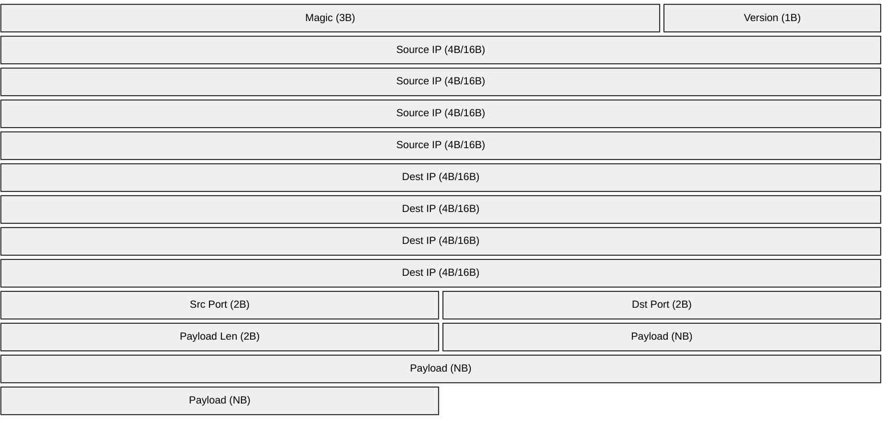

# Binary Stream Protocol

## Overview

The UDP sender reads packets from stdin using a binary protocol for sending multiple packets with different source addresses. The protocol supports both **IPv4** and **IPv6**.

## Protocol Specification

### Packet Format

Each packet in the stream follows this binary format (all multi-byte values in **network byte order** / big endian):



| Field | Size | Type | Description |
|-------|------|------|-------------|
| Magic | 3 bytes | const | Magic number `0xC1 0x21 0xB1` |
| Version | 1 byte | uint8 | IP version: `4` for IPv4, `6` for IPv6 |
| Source IP | 4 or 16 bytes | IPv4/IPv6 | Source IP address (4 bytes for IPv4, 16 bytes for IPv6) |
| Dest IP | 4 or 16 bytes | IPv4/IPv6 | Destination IP address (same size as source) |
| Source Port | 2 bytes | uint16 | Source port number (big endian) |
| Dest Port | 2 bytes | uint16 | Destination port number (big endian) |
| Payload Length | 2 bytes | uint16 | Length of payload in bytes (big endian) |
| Payload | Variable | bytes | Actual packet payload (0-65535 bytes) |

### Field Details

#### Magic (3 bytes)

- Constant value: `0xC1 0x21 0xB1`
- Used for packet synchronization and stream alignment detection
- If these bytes are not present, the stream is considered misaligned or corrupted
- The receiver will reject packets with invalid magic numbers

**Why a Magic Number?**

The magic number serves several important purposes:

1. **Stream Synchronization**: Helps detect when the byte stream has become misaligned due to corruption or partial reads
2. **Protocol Validation**: Ensures the sender and receiver are using compatible protocol versions
3. **Error Detection**: Provides an early indication of data corruption before attempting to parse the rest of the packet
4. **Debugging**: Makes it easier to identify packet boundaries when inspecting raw binary streams
5. **Forward Compatibility**: Allows for potential protocol versioning in the future

**Magic Number Selection**: The value `0xC1 0x21 0xB1` was chosen because:

- Not a common byte pattern in text or IP addresses
- Not all zeros or all ones (avoids accidental matches)
- Distinctive in hex dumps for easy visual identification

#### Version (1 byte)

- `4` = IPv4 packet (source IP will be 4 bytes)
- `6` = IPv6 packet (source IP will be 16 bytes)
- Any other value is invalid

#### Source IP (4 or 16 bytes)

**IPv4 (4 bytes):**

- IPv4 address in network byte order
- Example: `192.168.1.100` → `0xC0 0xA8 0x01 0x64`

**IPv6 (16 bytes):**

- IPv6 address in network byte order
- Example: `2001:db8::1` → `0x20 0x01 0x0D 0xB8 0x00 0x00 ... 0x00 0x01`

#### Dest IP (4 or 16 bytes)

**IPv4 (4 bytes):**

- IPv4 address in network byte order
- Must match the IP version specified in the Version field
- Example: `192.168.1.100` → `0xC0 0xA8 0x01 0x64`

**IPv6 (16 bytes):**

- IPv6 address in network byte order
- Must match the IP version specified in the Version field
- Example: `2001:db8::100` → `0x20 0x01 0x0D 0xB8 0x00 0x00 ... 0x01 0x00`

#### Source Port (2 bytes)

- Unsigned 16-bit integer in big endian
- Range: 0-65535
- Example: port `5555` → `0x15 0xB3`

#### Dest Port (2 bytes)

- Unsigned 16-bit integer in big endian
- Range: 0-65535
- Example: port `514` → `0x02 0x02`

#### Payload Length (2 bytes)

- Unsigned 16-bit integer in big endian
- Indicates the number of bytes in the payload
- Maximum: 65535 bytes
- Example: length `100` → `0x00 0x64`

#### Payload (Variable)

- Raw bytes of the UDP packet payload
- Length specified by Payload Length field
- Can be empty (length = 0)

## Examples

### Example 1: IPv4 Single Packet

Packet with:

- Magic: `0xC1 0x21 0xB1`
- Version: IPv4
- Source: `10.0.0.1:5000`
- Destination: `192.168.1.100:514`
- Payload: `"Hello"`

Binary representation (hexadecimal):

```text
C1 21 B1        # Magic: 0xC1 0x21 0xB1
04              # Version: 4 (IPv4)
0A 00 00 01     # Source IP: 10.0.0.1
C0 A8 01 64     # Dest IP: 192.168.1.100
13 88           # Source Port: 5000 (0x1388)
02 02           # Dest Port: 514 (0x0202)
00 05           # Payload Length: 5
48 65 6C 6C 6F  # Payload: "Hello"
```

### Example 2: IPv6 Single Packet

Packet with:

- Magic: `0xC1 0x21 0xB1`
- Version: IPv6
- Source: `2001:db8::1:5000`
- Destination: `2001:db8::100:8080`
- Payload: `"Hello"`

Binary representation (hexadecimal):

```text
C1 21 B1                                         # Magic: 0xC1 0x21 0xB1
06                                               # Version: 6 (IPv6)
20 01 0D B8 00 00 00 00 00 00 00 00 00 00 00 01  # Source IP: 2001:db8::1
20 01 0D B8 00 00 00 00 00 00 00 00 00 00 01 00  # Dest IP: 2001:db8::100
13 88                                            # Source Port: 5000
1F 90                                            # Dest Port: 8080 (0x1F90)
00 05                                            # Payload Length: 5
48 65 6C 6C 6F                                   # Payload: "Hello"
```

### Example 3: Multiple IPv4 Packets

Three packets in sequence, all to `192.168.1.100:514`:

**Packet 1:** `10.0.0.1:5000` → `192.168.1.100:514` with payload `"Test 1"`

```text
C1 21 B1 04 0A 00 00 01 C0 A8 01 64 13 88 02 02 00 06 54 65 73 74 20 31
```

**Packet 2:** `10.0.0.2:5001` → `192.168.1.100:514` with payload `"Test 2"`

```text
C1 21 B1 04 0A 00 00 02 C0 A8 01 64 13 89 02 02 00 06 54 65 73 74 20 32
```

**Packet 3:** `10.0.0.3:5002` → `192.168.1.100:514` with payload `"Test 3"`

```text
C1 21 B1 04 0A 00 00 03 C0 A8 01 64 13 8A 02 02 00 06 54 65 73 74 20 33
```

### Example 4: Mixed IPv4 and IPv6

IPv4 and IPv6 packets can be mixed in the same stream:

**Packet 1:** IPv4 `10.0.0.1:5000` → `192.168.1.100:514` with payload `"IPv4"`

```text
C1 21 B1 04 0A 00 00 01 C0 A8 01 64 13 88 02 02 00 04 49 50 76 34
```

**Packet 2:** IPv6 `2001:db8::1:5000` → `2001:db8::100:8080` with payload `"IPv6"`

```text
C1 21 B1 06 20 01 0D B8 00 00 00 00 00 00 00 00 00 00 00 01 20 01 0D B8 00 00 00 00 00 00 00 00 00 00 01 00 13 88 1F 90 00 04 49 50 76 36
```

### Example 5: Empty Payload

Packet with empty payload:

```text
C1 21 B1       # Magic: 0xC1 0x21 0xB1
04             # Version: 4 (IPv4)
0A 00 00 01    # Source IP: 10.0.0.1
C0 A8 01 64    # Dest IP: 192.168.1.100
13 88          # Source Port: 5000
02 02          # Dest Port: 514
00 00          # Payload Length: 0
               # (no payload bytes)
```

### Example 6: Invalid Magic Number Detection

If the magic number is incorrect, the stream is considered corrupted:

```text
FF FF FF       # Wrong magic: 0xFF 0xFF 0xFF (instead of 0xC1 0x21 0xB1)
04             # Version: 4
...
```

Error message:

```text
invalid magic number: got [0xFF 0xFF 0xFF], expected [0xC1 0x21 0xB1] - stream may be misaligned
```

## Usage

### Using the Packet Generator

The included `packet-generator.go` creates properly formatted packets for both IPv4 and IPv6:

```bash
# Generate 100 IPv4 packets to 192.168.1.100:514
go run packet-generator.go -count 100 -dest-ip 192.168.1.100 -dest-port 514 | \
  sudo ./udp-sender

# Generate 50 IPv6 packets
go run packet-generator.go -ipv6 -base-ip "2001:db8::1" -dest-ip "2001:db8::100" \
  -dest-port 8080 -count 50 | sudo ./udp-sender

# Save packets to file
go run packet-generator.go -count 1000 -dest-ip 192.168.1.100 -dest-port 514 > packets.bin

# Send from file later
cat packets.bin | sudo ./udp-sender
```

### Custom Packet Generator

Create packets programmatically:

#### Python Example

```python
import socket
import struct
import sys

def write_ipv4_packet(src_ip, src_port, dest_ip, dest_port, payload):
    # Magic bytes (0xC1 0x21 0xB1)
    sys.stdout.buffer.write(bytes([0xC1, 0x21, 0xB1]))
    
    # Version byte (4 = IPv4)
    sys.stdout.buffer.write(bytes([4]))
    
    # Convert source IP to bytes
    sys.stdout.buffer.write(socket.inet_aton(src_ip))
    
    # Convert destination IP to bytes
    sys.stdout.buffer.write(socket.inet_aton(dest_ip))
    
    # Pack source port and destination port
    sys.stdout.buffer.write(struct.pack('!HH', src_port, dest_port))
    
    # Pack payload length
    sys.stdout.buffer.write(struct.pack('!H', len(payload)))
    
    # Write payload
    sys.stdout.buffer.write(payload.encode())

def write_ipv6_packet(src_ip, src_port, dest_ip, dest_port, payload):
    # Magic bytes (0xC1 0x21 0xB1)
    sys.stdout.buffer.write(bytes([0xC1, 0x21, 0xB1]))
    
    # Version byte (6 = IPv6)
    sys.stdout.buffer.write(bytes([6]))
    
    # Convert source IPv6 to bytes
    sys.stdout.buffer.write(socket.inet_pton(socket.AF_INET6, src_ip))
    
    # Convert destination IPv6 to bytes
    sys.stdout.buffer.write(socket.inet_pton(socket.AF_INET6, dest_ip))
    
    # Pack source port and destination port
    sys.stdout.buffer.write(struct.pack('!HH', src_port, dest_port))
    
    # Pack payload length
    sys.stdout.buffer.write(struct.pack('!H', len(payload)))
    
    # Write payload
    sys.stdout.buffer.write(payload.encode())

# Generate IPv4 packets to 192.168.1.100:514
for i in range(10):
    write_ipv4_packet(f"10.0.0.{i+1}", 5000+i, "192.168.1.100", 514, f"IPv4 Packet #{i+1}")

# Generate IPv6 packets to 2001:db8::100:8080
for i in range(10):
    write_ipv6_packet(f"2001:db8::{i+1}", 5000+i, "2001:db8::100", 8080, f"IPv6 Packet #{i+1}")
```

Run: `python3 generate.py | sudo ./udp-sender`

#### Go Example

```go
package main

import (
    "encoding/binary"
    "net"
    "os"
)

func writeIPv4Packet(srcIP net.IP, srcPort uint16, payload []byte) {
    // Magic bytes (0xC1 0x21 0xB1)
    os.Stdout.Write([]byte{0xC1, 0x21, 0xB1})
    
    // Version byte (4 = IPv4)
    os.Stdout.Write([]byte{4})
    
    // Source IP (4 bytes)
    os.Stdout.Write(srcIP.To4())
    
    // Source Port and Payload Length (2 bytes each, big endian)
    binary.Write(os.Stdout, binary.BigEndian, srcPort)
    binary.Write(os.Stdout, binary.BigEndian, uint16(len(payload)))
    
    // Payload
    os.Stdout.Write(payload)
}

func writeIPv6Packet(srcIP net.IP, srcPort uint16, payload []byte) {
    // Magic bytes (0xC1 0x21 0xB1)
    os.Stdout.Write([]byte{0xC1, 0x21, 0xB1})
    
    // Version byte (6 = IPv6)
    os.Stdout.Write([]byte{6})
    
    // Source IP (16 bytes)
    os.Stdout.Write(srcIP.To16())
    
    // Source Port and Payload Length (2 bytes each, big endian)
    binary.Write(os.Stdout, binary.BigEndian, srcPort)
    binary.Write(os.Stdout, binary.BigEndian, uint16(len(payload)))
    
    // Payload
    os.Stdout.Write(payload)
}

func main() {
    // Generate IPv4 packets
    for i := 0; i < 10; i++ {
        srcIP := net.ParseIP("10.0.0.1").To4()
        srcIP[3] += byte(i)
        srcPort := uint16(5000 + i)
        payload := []byte("IPv4 packet")
        
        writeIPv4Packet(srcIP, srcPort, payload)
    }
    
    // Generate IPv6 packets
    for i := 0; i < 10; i++ {
        srcIP := net.ParseIP("2001:db8::1").To16()
        srcIP[15] += byte(i)
        srcPort := uint16(6000 + i)
        payload := []byte("IPv6 packet")
        
        writeIPv6Packet(srcIP, srcPort, payload)
    }
}
```

#### Node.js Example

```javascript
const fs = require('fs');
const net = require('net');

function writeIPv4Packet(srcIP, srcPort, payload) {
    // Magic bytes (0xC1 0x21 0xB1)
    process.stdout.write(Buffer.from([0xC1, 0x21, 0xB1]));
    
    // Version byte (4 = IPv4)
    process.stdout.write(Buffer.from([4]));
    
    // Parse IP
    const ipParts = srcIP.split('.').map(Number);
    const ipBuffer = Buffer.from(ipParts);
    process.stdout.write(ipBuffer);
    
    // Create buffers
    const portBuffer = Buffer.allocUnsafe(2);
    portBuffer.writeUInt16BE(srcPort);
    
    const payloadBuffer = Buffer.from(payload);
    const lenBuffer = Buffer.allocUnsafe(2);
    lenBuffer.writeUInt16BE(payloadBuffer.length);
    
    // Write to stdout
    process.stdout.write(Buffer.concat([portBuffer, lenBuffer, payloadBuffer]));
}

function writeIPv6Packet(srcIP, srcPort, payload) {
    // Magic bytes (0xC1 0x21 0xB1)
    process.stdout.write(Buffer.from([0xC1, 0x21, 0xB1]));
    
    // Version byte (6 = IPv6)
    process.stdout.write(Buffer.from([6]));
    
    // Parse IPv6 (16 bytes)
    const ipBuffer = Buffer.alloc(16);
    const parts = srcIP.split(':');
    // Simplified IPv6 parsing (real implementation would handle :: notation)
    // ... (full implementation would parse IPv6 properly)
    
    process.stdout.write(ipBuffer);
    
    // Port and payload
    const portBuffer = Buffer.allocUnsafe(2);
    portBuffer.writeUInt16BE(srcPort);
    
    const payloadBuffer = Buffer.from(payload);
    const lenBuffer = Buffer.allocUnsafe(2);
    lenBuffer.writeUInt16BE(payloadBuffer.length);
    
    process.stdout.write(Buffer.concat([portBuffer, lenBuffer, payloadBuffer]));
}

// Generate IPv4 packets
for (let i = 0; i < 10; i++) {
    writeIPv4Packet(`10.0.0.${i+1}`, 5000 + i, `IPv4 Packet #${i+1}`);
}
```

Run: `node generate.js | sudo ./udp-sender 514 192.168.1.100`

## Error Handling

The stream processor will terminate with an error if:

1. **Invalid magic number**: Stream is misaligned or corrupted (e.g., `invalid magic number: got [0xFF 0xFF 0xFF], expected [0xC1 0x21 0xB1]`)
2. **Invalid IP version**: Version byte is not 4 or 6
3. **EOF encountered mid-packet**: Incomplete packet data
4. **Read errors**: I/O errors reading from stdin
5. **Send errors**: Network errors sending packets (except MTU errors, see below)

### MTU Validation

The sender validates payload sizes against Maximum Transmission Unit (MTU) limits to prevent packet fragmentation. The MTU is configurable via the `-m` or `--mtu` command line option (default: 1500 bytes, range: 576-9000 bytes).

**Default limits** (with standard 1500-byte MTU):

- **IPv4 packets**: Maximum payload size is **1472 bytes** (1500 MTU - 20 IP header - 8 UDP header)
- **IPv6 packets**: Maximum payload size is **1452 bytes** (1500 MTU - 40 IPv6 header - 8 UDP header)

**Custom MTU examples**:

```bash
# Use jumbo frames (9000 MTU) for larger payloads
cat packets.bin | sudo ./udp-sender -m 9000
# IPv4 max: 8972 bytes, IPv6 max: 8952 bytes

# Use reduced MTU (1400) for specific networks
cat packets.bin | sudo ./udp-sender -m 1400
# IPv4 max: 1372 bytes, IPv6 max: 1352 bytes
```

**Behavior for oversized packets**:

- Packet is rejected and **not sent**
- Error is logged with detailed information (packet number, payload size, IPs, ports)
- Processing **continues** with the next packet (non-fatal error)
- Dropped packets are tracked separately in statistics

**Example log output for dropped packet**:

```json
{
  "time": "2025-10-24T10:30:45Z",
  "level": "error",
  "message": "Packet dropped due to MTU limit",
  "packet_number": 42,
  "payload_size": 2000,
  "source_ip": "192.168.1.1",
  "source_port": 12345,
  "dest_ip": "192.168.1.2",
  "dest_port": 54321,
  "error": "payload size 2000 exceeds MTU limit for IPv4 (1472 bytes)"
}
```

**Final statistics include dropped packets**:

```json
{
  "time": "2025-10-24T10:30:50Z",
  "level": "info",
  "message": "Stream complete",
  "packets_sent": 98,
  "packets_dropped": 2,
  "bytes_sent": 142856
}
```

Error messages include:

- Packet number where error occurred
- Field being read when error happened
- Number of packets successfully sent before error
- Specific details about the error (e.g., expected vs actual magic bytes)

### Common Error Scenarios

**Misaligned Stream**:

```text
Error: invalid magic number: got [0x0A 0x00 0x00], expected [0xC1 0x21 0xB1] - stream may be misaligned
```

This indicates the stream has lost synchronization. Common causes:

- Incomplete write to the stream
- Binary data corruption during transmission
- Mixing protocols with different magic numbers

**Invalid Version**:

```text
Error: invalid IP version: 8 (must be 4 or 6)
```

This could indicate data corruption or using an incompatible protocol version.

## Performance

- **Buffered I/O**: Uses `bufio.Reader` for efficient reading
- **Progress feedback**: Shows progress every 100 packets to stderr
- **Continuous streaming**: No artificial delays between packets
- **Memory efficient**: Reads and sends one packet at a time

## Best Practices

1. **Validate input**: Ensure source IPs are valid IPv4/IPv6 addresses
2. **Payload size**: Keep payloads within MTU limits:
   - **IPv4**: Maximum 1472 bytes (default 1500 MTU)
   - **IPv6**: Maximum 1452 bytes (default 1500 MTU)
   - Adjust with `-m` or `--mtu` flag if your network supports different MTU sizes
   - Oversized packets will be automatically dropped with error logging
3. **Error checking**: Monitor stderr for progress and error messages, including MTU violations
4. **Testing**: Test with small packet counts first
5. **Rate limiting**: Consider adding delays in packet generator for high-volume streams
6. **Monitor dropped packets**: Check the `packets_dropped` field in final statistics to identify MTU issues

## Debugging

### View Binary Stream

```bash
# Generate and hexdump packets
go run packet-generator.go -count 3 | hexdump -C
```

### Verify Protocol

```bash
# Generate packets and verify they're sent
go run packet-generator.go -count 5 2>&1 | \
  sudo ./udp-sender 8080 127.0.0.1 2>&1

# Expected output:
# Generating 5 packets starting from 10.0.0.1:5000...
# Stream mode: reading packets from stdin...
# Protocol: [Magic(3)][Version(1)][SrcIP(4 or 16)][SrcPort(2)][PayloadLen(2)][Payload(N)]
# Complete: generated 5 packets
# Stream complete: sent 5 packets, XXX bytes total
```

## Limitations

1. **Version field required**: All packets must include the version byte
2. **Max payload**: Limited by MTU to prevent fragmentation:
   - **IPv4**: 1472 bytes maximum (default 1500 MTU)
   - **IPv6**: 1452 bytes maximum (default 1500 MTU)
   - Configurable via `-m` or `--mtu` command line option (range: 576-9000 bytes)
   - Protocol supports up to 65535 bytes (uint16 limit), but packets exceeding MTU are dropped
3. **No checksums**: Protocol doesn't include checksums (relies on UDP layer)
4. **Sequential only**: Packets must be sent in sequence (no random access)
5. **Mixed streams**: IPv4 and IPv6 packets can be mixed in the same stream
6. **Fragmentation not supported**: Packets exceeding MTU are dropped rather than fragmented

## Future Enhancements

Potential protocol improvements:

- Optional packet ID field for tracking
- Timestamp field for packet timing
- Batch/burst control
- Protocol version negotiation
